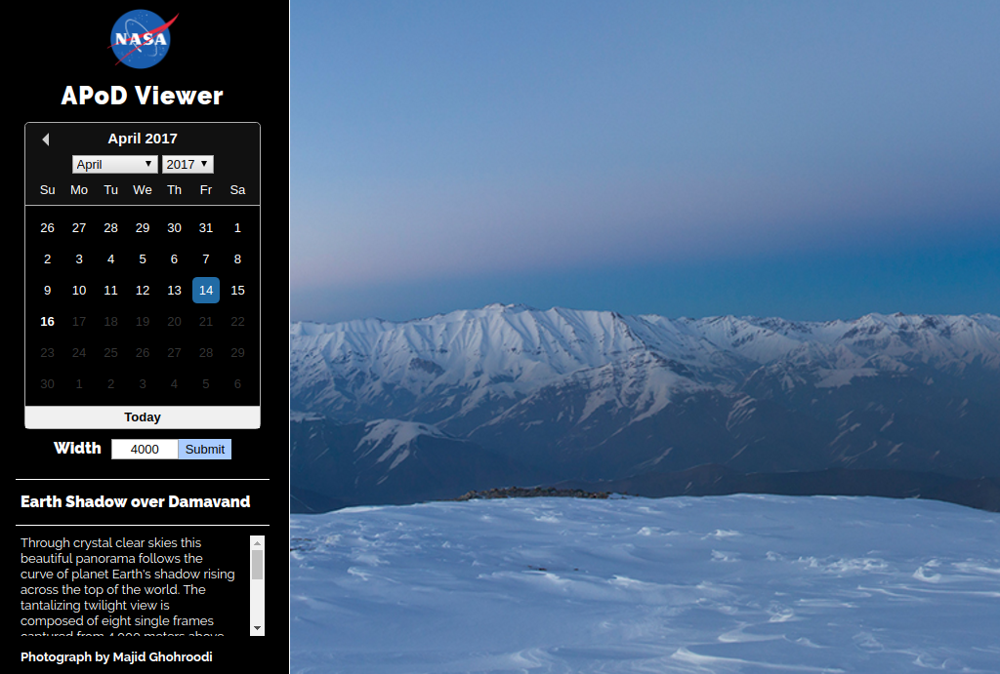

# APoD View

[Live Link](http://apodview.herokuapp.com)

APoD View is a NASA Astronomy Picture of the Day viewer.  

*The application is currently hosted in the free tier of Heroku.  Please allow upto 30 seconds for the dyno to spin up.*

## Implementation
The image viewer application has been created React with create-react-app build configuration.  Redux has been utilized as the state management library.  

The following libraries have been utilized:
- react
- redux
- redux-thunk
- redux-logger
- react-cookie
- react-datepicker
- react-element-pan
- styled-components
- moment

## Installation

Extract the included zip file and run `npm install` to install the dependencies.

Enter `npm start` in the terminal to start the development server.  The application can be accessed from `http://localhost:3000/`.  
